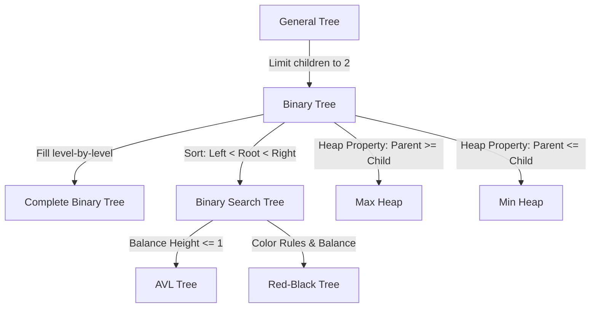

# Section A understand and clearly define:

**1. General Tree**  

A **General Tree** is a non-linear data structure consisting of nodes organized in a hierarchical manner.Each node can have zero or multiple child nodes. There is **no limit** on the number of children a node can possess.

**2. Binary Tree**  

A **Binary Tree** is a tree structure where each node is restricted to having **at most two children**.

**3. Complete Binary Tree**  

A **Complete Binary Tree** is a binary tree in which every level, except possibly the last, is completely filled. On the last level, all nodes are filled from **left to right** without any gaps.

**4. Binary Search Tree (BST)**  

A **Binary Search Tree (BST)** is a binary tree that The values in its **left** subtree are strictly **less than** the node's value, and the values in its **right** subtree are strictly **greater than** the node's value.

**5. AVL Tree**  

An **AVL Tree** is a **self-balancing** Binary Search Tree (BST). It maintains a balance property where the difference in heights between the left and right subtrees of any node. If violates this property, the tree automatically performs rotations to restore balance.

**6. Red-Black Tree**  

A **Red-Black Tree** is a self-balancing BST that uses a color attribute (red or black) for each node to ensure balance. It guarantees that the longest path from the root to a leaf is no more than twice as long as the shortest path.

**7. Max Heap**  

A **Max Heap** is a complete binary tree that satisfies the heap property: the value of every parent node is **greater than or equal to** the values of its children. The largest element in the tree is always located at the root.

**8. Min Heap**  

A **Min Heap** is a complete binary tree that satisfies the heap property: the value of every parent node is **less than or equal to** the values of its children. The smallest element in the tree is always located at the root.

# Section B. Build a hierarchy and transformation path from the general tree to these variants

## 1. Tree Family Hierarchy Diagram
This diagram illustrates the specialization path from the most general structure to specific variants.

| From | To | New Property / Constraint Added |
| :--- | :--- | :--- |
| **General Tree** | **Binary Tree** | Limit children to 2 |
| **Binary Tree** | **Complete Binary Tree** | Fill level-by-level |
| **Binary Tree** | **Binary Search Tree (BST)** | Sort: Left < Root < Right |
| **BST** | **AVL Tree** | Balance Height <= 1 |
| **BST** | **Red-Black Tree** | Color Rules & Balance |
| **Binary Tree** | **Max Heap** | Heap Property: Parent >= Child |
| **Binary Tree** | **Min Heap** | Heap Property: Parent <= Child |
