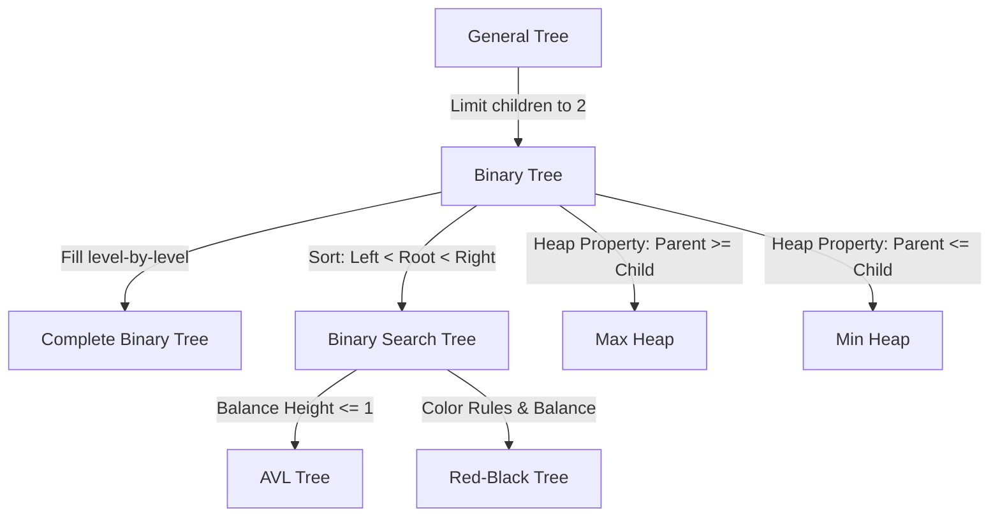

# Section A. Understand and clearly define:

**1. General Tree**  

A **General Tree** is a non-linear data structure consisting of nodes organized in a hierarchical manner.Each node can have zero or multiple child nodes. There is **no limit** on the number of children a node can possess.

**2. Binary Tree**  

A **Binary Tree** is a tree structure where each node is restricted to having **at most two children**.

**3. Complete Binary Tree**  

A **Complete Binary Tree** is a binary tree in which every level, except possibly the last, is completely filled. On the last level, all nodes are filled from **left to right** without any gaps.

**4. Binary Search Tree (BST)**  

A **Binary Search Tree (BST)** is a binary tree that The values in its **left** subtree are strictly **less than** the node's value, and the values in its **right** subtree are strictly **greater than** the node's value.

**5. AVL Tree**  

An **AVL Tree** is a **self-balancing** Binary Search Tree (BST). It maintains a balance property where the difference in heights between the left and right subtrees of any node. If violates this property, the tree automatically performs rotations to restore balance.

**6. Red-Black Tree**  

A **Red-Black Tree** is a self-balancing BST that uses a color attribute (red or black) for each node to ensure balance. It guarantees that the longest path from the root to a leaf is no more than twice as long as the shortest path.

**7. Max Heap**  

A **Max Heap** is a complete binary tree that satisfies the heap property: the value of every parent node is **greater than or equal to** the values of its children. The largest element in the tree is always located at the root.

**8. Min Heap**  

A **Min Heap** is a complete binary tree that satisfies the heap property: the value of every parent node is **less than or equal to** the values of its children. The smallest element in the tree is always located at the root.

# Section B. Build a hierarchy and transformation path from the general tree to these variants

## 1. Tree Family Hierarchy Diagram
This diagram illustrates the specialization path from the most general structure to specific variants.

| From | To | New Property / Constraint Added |
| :--- | :--- | :--- |
| **General Tree** | **Binary Tree** | Limit children to 2 |
| **Binary Tree** | **Complete Binary Tree** | Fill level-by-level |
| **Binary Tree** | **Binary Search Tree (BST)** | Sort: Left < Root < Right |
| **BST** | **AVL Tree** | Balance Height <= 1 |
| **BST** | **Red-Black Tree** | Color Rules & Balance |
| **Binary Tree** | **Max Heap** | Heap Property: Parent >= Child |
| **Binary Tree** | **Min Heap** | Heap Property: Parent <= Child |

# Section C. Tree Constructions Using Given Integers

**Given Integers:**
`37, 142, 5, 89, 63, 117, 24, 176, 58, 133, 92, 11, 151, 72, 39, 184, 7, 101, 54, 160`

---

#### 1. Binary Tree
* **Tool name / URL**: [e.g., treeconverter](https://treeconverter.com/)
* **Construction description**: Inserted integers in the given order.
* **Screenshot**:
   >  

#### 2. Complete Binary Tree
* **Tool name / URL**: [e.g., treeconverter](https://treeconverter.com/)
* **Construction description**: Constructed by filling nodes strictly from top to bottom and left to right. No gaps were left.
* **Screenshot**:
   >  

#### 3. Binary Search Tree (BST)
* **Tool name / URL**: [e.g., USFCA BST Visualizer](https://www.cs.usfca.edu/~galles/visualization/BST.html)
* **Construction description**:  For each value, compared it with the root: smaller values went to the left subtree, and larger values went to the right subtree. No balancing operations were performed.
* **Screenshot**:
   >  

#### 4. AVL Tree
* **Tool name / URL**: [e.g., USFCA AVL Tree Visualizer](https://www.cs.usfca.edu/~galles/visualization/AVLtree.html)
* **Construction description**: Inserted elements sequentially. After every insertion, the tree checked the balance factor of each node.
* **Screenshot**:
   >  

#### 5. Red-Black Tree
* **Tool name / URL**: [e.g., USFCA Red-Black Tree Visualizer](https://www.cs.usfca.edu/~galles/visualization/RedBlack.html)
* **Construction description**: Inserted elements using standard BST insertion, initially coloring new nodes red. Then, fixed any violations of Red-Black properties (such as double red nodes) using recoloring and rotations.
* **Screenshot**:
  > 

#### 6. Max Heap
* **Tool name / URL**: [e.g., Max Heap Simulator](https://sercankulcu.github.io/files/data_structures/slides/Bolum_08_Heap.html)
* **Construction description**: Built using the insertion method. Each new element was added to the next available position in the complete binary tree structure and then "bubbled up" (swapped with its parent) until the heap property (Parent ≥ Child) was satisfied.
* **Screenshot**:
  >  

#### 7. Min Heap
* **Tool name / URL**: [e.g., USFCA Heap Visualizer](https://www.cs.usfca.edu/~galles/visualization/Heap.html)
* **Construction description**: Similar to the Max Heap, but enforced the property that Parent ≤ Child. New elements were inserted at the end and bubbled up if they were smaller than their parent.
* **Screenshot**:
  >   

# Section D. Application Examples for Each Tree

The following table lists a real-world or system-level application for each tree variant and explains why the structure is suitable.

| Tree Type | Application Example | Why this tree fits (Properties that matter) |
| :--- | :--- | :--- |
| **Binary Tree** | **Expression Trees** | It naturally represents the structure of operators and operands (left and right). Evaluation can be easily performed via tree traversal. |
| **Complete Binary Tree** | **Basis for Heap Data Structures** | Its compact structure allows it to be efficiently stored in an **array** without gaps, providing excellent space and access efficiency. |
| **Binary Search Tree** | **Dynamic Data Search** (Dictionaries, Symbol Tables) | Its sorted property makes searching and updating efficient in average-case scenarios. |
| **AVL Tree** | **Search-Intensive Systems** (Read-heavy databases) | It maintains strict height balance, guaranteeing stable $O(\log n)$ search performance even in worst-case scenarios. |
| **Red-Black Tree** | **Standard Libraries** (e.g., C++ map/set) | Its balancing criteria are looser than AVL trees, resulting in lower costs (fewer rotations) for insertions and deletions. |
| **Max Heap** | **Priority Queues** (Accessing Max Value) | The largest element is always located at the root, making it extremely fast to access the highest priority item. |
| **Min Heap** | **Scheduling Systems / Shortest Path Algorithms** | It provides fast access to the minimum element ($O(1)$), which is ideal for weight-based comparisons or processing shortest tasks first. |

---

# Section E. AI Usage Log

As required by the assignment policy, this table records the usage of AI tools for learning and organizing this report.

| Index | AI Service | Your Full Prompt / Question |
| :--- | :--- | :--- |
| 1 | Gemini | Explain the definitions of General tree, Binary tree, and other variants. |
| 2 | Gemini | Provide a hierarchy diagram showing the relationship between tree types. |
| 3 | Gemini | What are the real-world applications for Red-Black trees and AVL trees? |
| 4 | Gemini | Help me organize the structure of the assignment report in Markdown. |
| 5 | Gemini | How to fix the image display issue in Markdown on GitHub? |
